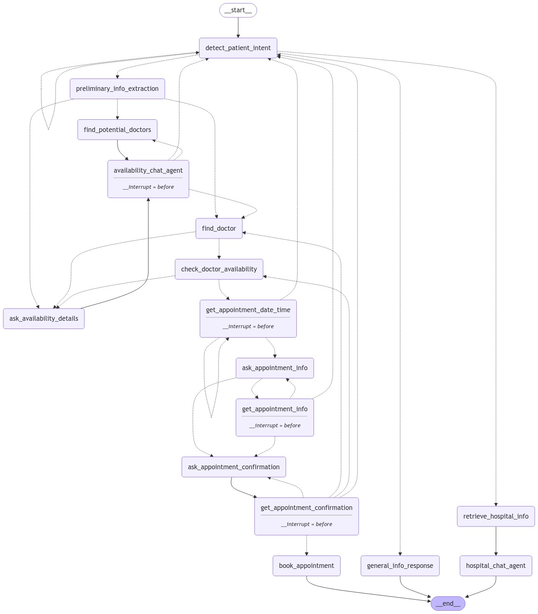

# Hospital Nagivation Chat Interface

The project is a chat interface that allows users to interact with a mock hospital system. The chat interface is powered by OpenAI's GPT-4o model and allows users to ask questions and get responses in real-time. The chat interface is designed to help users navigate the hospital system and get information about various services offered by the hospital.

The project is build using `FastAPI`, `LangGraph` and `Reactjs`. The chat interface is designed to be user-friendly and easy to use. The chat interface is designed to be responsive and work on all devices. The communication between the chat interface and the hospital system is done using a REST API. The commication between the Server and web interface is done using Websockets.

This is the image of the how the LangGraph works:


## Installation
Make sure to have python3 installed on your system. Then run the following commands:

- Install the required packages using the required:
```bash
pip install -r requirements.txt
```

## Usage
### Development
- Run the following command to start the chat interface:
```bash
python -m fastapi dev app/main.py
```
or
```bash
fastapi dev app/main.py
```

- Open the interface in your browser by visiting the following URL:
http://localhost:8000

### Production
```bash
python -m fastapi run app/main.py
```
or
```bash
fastapi run app/main.py
```

## Environment Variables
- Create a `.env` file in the root directory of the project and add the following environment variables:
```bash
OPENAI_API_KEY=<YOUR_OPENAI_API_KEY>
MOCK_HOSPITAL_SYSTEM_BASE_URL=<MOCK_HOSPITAL_SYSTEM_BASE_URL>
LANGCHAIN_API_KEY=<YOUR_LANGCHAIN_API_KEY>
LANGCHAIN_TRACING_V2=true
LANGCHAIN_PROJECT=hospital-navigation
DATABASE_URL=sqlite:///./feedback.db
# For production only
DATABASE_AUTH_TOKEN=<YOUR_AUTH_TOKEN>

```

## Deployment
### Prerequisites
- Docker
- SST (Serverless Stack Toolkit) CLI. You can read more [here](https://sst.dev/docs)
- AWS Account
- AWS CLI

### Deployment Steps
- Create a `.env.production` file in the root directory of the project and add the environment variables mentioned above.
- Update the configuration in `sst.config.ts` to match your AWS account or resources.
- Run the following command to deploy the project:
```bash
sst deploy --stage production
```
