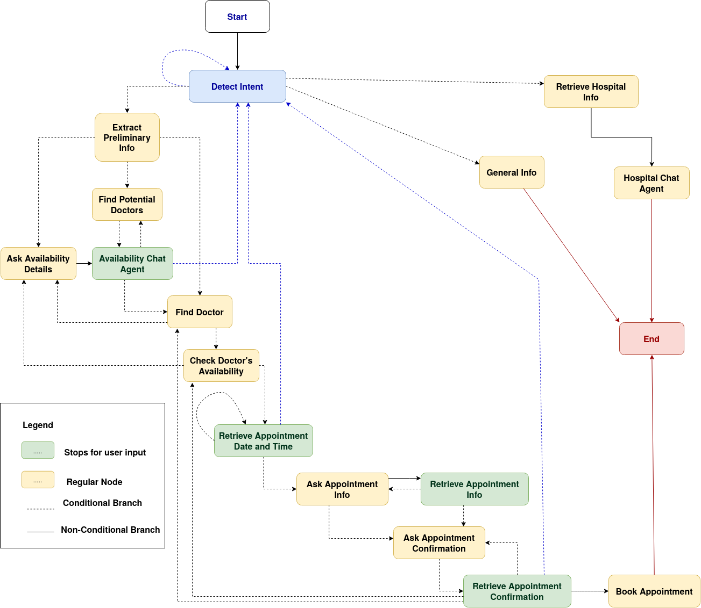

# Hospital Navigation Chat Interface Documentation

## Overview

The **Hospital Navigation Chat Interface** is a conversational AI system designed to assist patients with navigating hospital services. It integrates **OpenAI's GPT-4o**, **LangGraph**, and **FAISS** to provide an intuitive, real-time interaction experience. 

The backend uses **FastAPI** for API handling, **LangGraph** for complex control flow, and **FAISS** for efficient vector-based document retrieval. The system is deployed using **AWS Fargate** for scalability and reliability, ensuring smooth operations under varying loads.

---

## Features

- **Conversational AI**: Real-time responses tailored to user queries.
- **LangGraph Workflow**: Structured and dynamic conversation control.
- **FAISS Vector Search**: Fast and accurate document similarity matching.
- **Responsive Design**: Optimized for all devices.
- **Scalable Deployment**: AWS Fargate ensures high performance and reliability.
- **WebSocket Communication**: Real-time updates between the server and chat interface.

---

## Installation

### Prerequisites

Ensure the following tools are installed on your system:

1. **Python**: v3.8 or later ([Download Python](https://www.python.org/))  
2. **pip**: Latest version ([Learn about pip](https://pip.pypa.io/en/stable/))  
3. **Docker** ([Install Docker](https://docs.docker.com/get-docker/))  

For deployment:
- **AWS CLI** ([Install AWS CLI](https://docs.aws.amazon.com/cli/latest/userguide/install-cliv2.html))  
- **SST CLI**: Follow the official [SST installation guide](https://sst.dev/).  

---

### Installation Steps

1. Clone the repository:
    ```bash
    git clone https://github.com/your-repo-url.git
    cd your-repo-name
    ```

2. Install Python dependencies:
    ```bash
    pip install -r requirements.txt
    ```

3. If deploying via SST, skip the Node.js requirement by following [SST without Node.js](https://sst.dev/advanced/without-nodejs.html).

---

## Usage

### Development Mode

1. Start the development server:
    ```bash
    python -m fastapi dev app/main.py
    ```

    OR

    ```bash
    fastapi dev app/main.py
    ```

2. Access the chat interface in your browser:
    ```
    http://localhost:8000
    ```

---

### Production Mode

1. Run the server in production mode:
    ```bash
    python -m fastapi run app/main.py
    ```

    OR

    ```bash
    fastapi run app/main.py
    ```

2. Use your configured URL to access the production interface.

---

## Environment Variables

Define necessary environment variables in a `.env` file for development or `.env.production` for production:

```env
OPENAI_API_KEY=<YOUR_OPENAI_API_KEY>
MOCK_HOSPITAL_SYSTEM_BASE_URL=<MOCK_HOSPITAL_SYSTEM_BASE_URL>
LANGCHAIN_API_KEY=<YOUR_LANGCHAIN_API_KEY>
LANGCHAIN_TRACING_V2=true
LANGCHAIN_PROJECT=hospital-navigation
DATABASE_URL=sqlite:///./feedback.db
# Production Only
DATABASE_AUTH_TOKEN=<YOUR_AUTH_TOKEN>
```

---

## Deployment

### Deployment to AWS with Fargate

The **Hospital Navigation Chat Interface** is deployed using **AWS Fargate**, managed by **SST**. Fargate provides a fully managed serverless container platform, allowing seamless scaling without managing underlying infrastructure.

---

### Benefits of AWS Fargate
1. **Serverless Infrastructure**: Reduces operational overhead.
2. **Scalability**: Automatically scales resources based on demand.
3. **Reliability**: Ensures consistent performance with minimal downtime.
4. **Security**: Built-in isolation and compliance.

---

### Deployment Steps

1. **Prepare Environment Variables**:
    - Create a `.env.production` file and include production-specific variables:
      ```env
      OPENAI_API_KEY=<YOUR_OPENAI_API_KEY>
      MOCK_HOSPITAL_SYSTEM_BASE_URL=https://your-backend-url
      LANGCHAIN_API_KEY=<YOUR_LANGCHAIN_API_KEY>
      DATABASE_AUTH_TOKEN=<YOUR_AUTH_TOKEN>
      ```

2. **Update SST Configuration**:
    - Open `sst.config.ts` and configure the stack for your AWS account.

3. **Deploy Using SST**:
    - Run the SST deployment command:
      ```bash
      sst deploy --stage production
      ```

4. **Access the Application**:
    - Retrieve the Fargate URL from the SST deployment logs or AWS Console.
    - Use the URL to access the deployed chat interface.

---

## LangGraph Workflow

The **LangGraph Workflow** powers the control flow of the Hospital Navigation Chat Interface, ensuring accurate and structured responses for various use cases, including hospital information retrieval and appointment bookings.

### Graph Representation



LangGraph enables:
- **Complex Decision-Making**: Handles conditional logic for user interactions.
- **Contextual Conversations**: Maintains state for accurate and relevant replies.

---

## Best Practices

1. **Secure Environment Variables**: Never expose sensitive keys like `OPENAI_API_KEY` in public repositories.
2. **Scalability**: Deploy FAISS vector search on a dedicated server for better performance.
3. **Testing**: Regularly test conversational flows using LangGraph's built-in simulation tools.
4. **Error Handling**: Implement middleware to catch and gracefully manage exceptions.

---

## Additional References

- **FastAPI Documentation**: [FastAPI Docs](https://fastapi.tiangolo.com/)  
- **LangGraph Documentation**: [LangGraph Docs](https://docs.langgraph.ai/)  
- **FAISS Documentation**: [FAISS Docs](https://faiss.ai/)  
- **AWS Fargate Documentation**: [Fargate Docs](https://aws.amazon.com/fargate/)  
- **SST Documentation**: [SST Docs](https://sst.dev/)  

